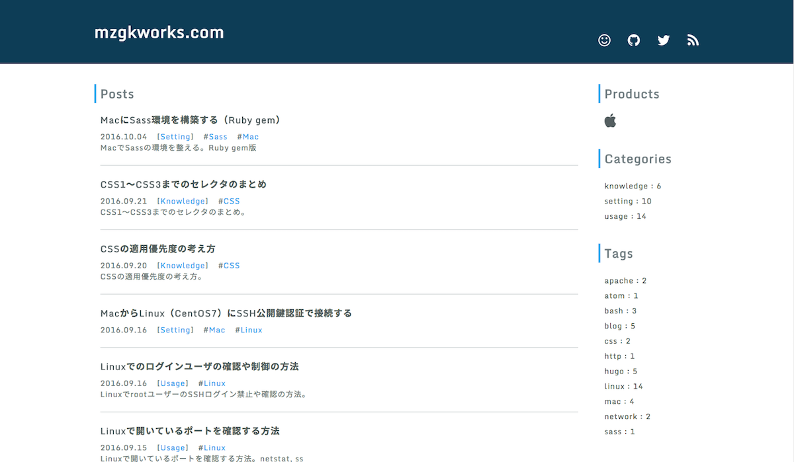

# Masamune（正宗）

## Overview

Masamune is a 2 column simple blog theme for Hugo.

- Simple and clean design
- Pagination
- Category
- Tag
- Disqus
- Source code highlighting
- Google Analytics

## Screenshot


## Installation
Clone this repository to your hugo theme directory.

```@bash
$ cd themes
$ git clone https://github.com/mzgk/masamune
$ hugo server -t masamune -D -w
```


## Configuration
To take full advantage of the features in this theme, you can add variables to your site config file.

The following is the example configuration.

```@toml
baseurl = "your site url"
title = "site title"
languageCode = "your site languageCode"

canonifyurls = true
hasCJKLanguage = true -> if your site language is Chinese Japanese Korea

auther = "your name"
theme = "masamune"

# Hugo Built-in Features
disqusShortname = "xxxxx"
enableRobotsTXT = true

[params]
subTitle = "site subtitle"
copyrightYear = "2016"
copyrightName = "your name"
profileImage = "./images/profile.png"
googleAnalytics = "xxxxxx"

[params.meta]
description = "meta tag data"
keywords = "meta tag data"

[params.social]
github = "https://github.com/xxxx"
twitter = "https://twitter.com/xxxx"
```

Details of each parameter are as follows.

| Parameter | Required | Comment |
| :--- | :--- | :--- |
| baseurl | yes | Enter the URL of your site. |
| title | yes | Enter the title of your site. |
| languageCode | yes | Enter the language code of HTML. Example: en-US, ja-JP. |
| canonifyurls | yes | true |
| isCKJLanguage | no | true |
| disqusShortname | no | Enter the short name of the disqus. If you do not enter, disqus section is hidden. |
| enableRobotsTXT | no | true |
| subTitle | no | Enter the subtitle of your site. If you do not enter, subtitle is hidden. |
| copyrightYear | no | Enter the copyright year. If you do not enter, copyright display is hidden. |
| copyrightName | no | Enter the copyright notice. If you do not enter, copyright display is hidden. |
| profileImage | no | Enter the path to the profile image. If you do not enter, profile section will be hidden. |
| googleAnalytics | no | Enter the tracking ID of Google analytics. If you do not enter, the analysis will be skipped. |
| description | no | meta tag data |
| keywords | no | meta tag data |
| github | no | Enter the URL of Github. If you do not enter, the link is hidden. |
| twitter | no | Enter the URL of Twitter. If you do not enter, the link is hidden. |


## License
Open sourced under the [MIT license](https://github.com/mzgk/masamune/blob/master/LICENSE.md).


## Author
mzgk


## Contact
Please contact me via [email](https://github.com/mzgk) / [Twitter](https://twitter.com/mzgkworks) :smile:
